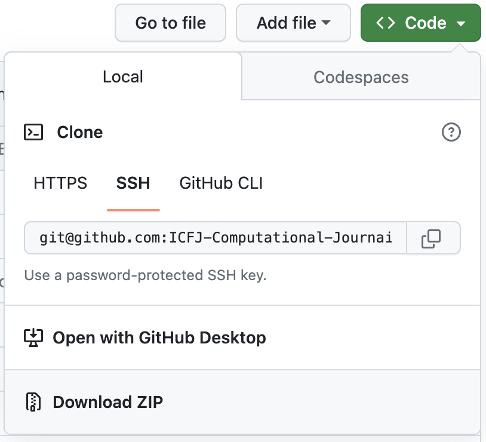
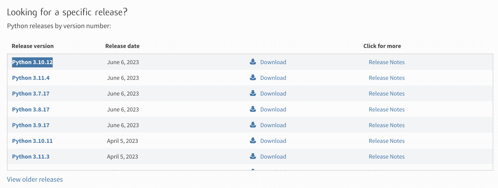

# Computational Journalism Lessons for Iranian Journalists
Welcome to these introductory lessons on computational reporting! This course is directed at Iranian journalists and advocates who are interested in using data and programmatic methods to improve their reporting. No prior coding experience is necessary, but some familiarity with basic statistics will be helpful.

The majority of these lessons will be written in the programming language Python. Python is a general-purpose programming language that can be used for various things ranging from mobile apps to machine learning. Python is also one of the [most popular](https://survey.stackoverflow.co/2022/#technology-most-popular-technologies) programming languages currently. Here we will primarily go over how to use Python for data analysis, data visualization, scraping, and natural language processing (where we analyze data made of natural languages like Persian or English).

In this introduction, we will:
- get an overview of lessons and how to use this course,
- go over how to download this code and run it locally, and
- learn some basics of Python and Jupyter notebooks.

## How to use this course
This course is broken up into modules. It is recommended that you complete a given module in order, and do the prerequisites first. Otherwise, you are welcome to take the modules in whatever order you prefer.

For example, you need take the **Data analysis** module first. But then after that, you might take the **NLP** module before taking the **Data visualization** module.

### Lesson overview

**1. Data analysis**    
&nbsp;&nbsp;1. Introduction to pandas    
&nbsp;&nbsp;2. Basics of statistics    
&nbsp;&nbsp;3. Working with time data    
&nbsp;&nbsp;4. Combining data from multiple tables    
&nbsp;&nbsp;5. Introduction to data cleaning    
<br>

**2. Data visualization**    
_(prerequisite: 1. Data analysis)_    
&nbsp;&nbsp;1. Introduction to basic charts    
&nbsp;&nbsp;2. Adding text and annotations to our charts    
&nbsp;&nbsp;3. Introduction to basic mapping    
&nbsp;&nbsp;4. Introduction to map projections    
&nbsp;&nbsp;5. Combining different types of geographic data for insight    
<br>

**3. APIs**    
_(prerequisite: 1. Data analysis)_    
&nbsp;&nbsp;1. What is an API, and why would we use one?    
&nbsp;&nbsp;2. Building a Telegram bot    
&nbsp;&nbsp;3. Telegram bot examples    
&nbsp;&nbsp;4. GitHub Actions    
<br>

**4. Scraping without an API**    
_(prerequisite: 1. Data analysis, 3. APIs )_    
&nbsp;&nbsp;1. Scraping static sites    
&nbsp;&nbsp;2. Sraping dynamic sites    
&nbsp;&nbsp;3. Getting data from PDFs: Tabula and OCR    
<br>

**5. Natural Language Processing (NLP)**   
_(prerequisite: 1. Data analysis)_     
&nbsp;&nbsp;1. Introduction to NLP    
&nbsp;&nbsp;2. Words as data    

## Technical instructions
### Getting this code
All the code for this project is stored (or "hosted") on GitHub, which is a website that hosts a lot of code. It is used a lot for open-source projects as well as just projects that might require collaboration from multiple coders. For now, we are primarily using it as a place to find our code. (Note: If you are interested in learning about version control with git, you can try out [this tutorial in English](https://git-scm.com/docs/gittutorial/en) or [this one in Persian](http://git.codecast.ir/en/latest/index.html), but for the most part, it is not needed for our lessons here.)

Each project is called a "repository." You can find the repository for this project here: 
https://github.com/ICFJ-Computational-Journaism/computational-journalism-lessons

To download the code, you can press the green "Code" button. You can download as a ZIP file, and open it up once downloaded:



Once you have installed this folder, you can uncompress this, and it will create a series of folders.

### Install and setup with Python
#### Downloading Python
You can download Python [here](https://www.python.org/downloads/). Note that it depends on your computer's operating system.

For this lesson, we will want to download some **Python version 3.10**. In this screencap, we would want to download version `3.10.12`:


After you have downloaded it, make sure to follow the steps to install Python.

### Opening the terminal
To run our code, we will need to user our terminal.

- In Windows, we would open either the "Command Prompt" or "Powershell" app. For more information, you can check [this guide](https://www.makeuseof.com/tag/a-beginners-guide-to-the-windows-command-line/)
- In macOS, this would be the "terminal" app.

Inside the terminal, we can use "shell commands" to navigate our file system and run code from inside our terminal. Shell scripting is a very powerful tool, but we only require a few operations here.

### Navigate to our directory in the terminal
#### `pwd`
By default, when you open the terminal, it opens up in your "root directory." If you want to check what directory you are in, you can use the `pwd` command. This stands for "present working directory." A "directory" is just another word for a file folder.

#### `ls`
If you want to see what files and subfolders are in our directory, we can use the `ls` command. This is short for "list," as in we want to "list" out what is inside a directory.

#### `cd`
Next we will need to navigate to the directory that contains our code. By default, our files are downloaded in the `Downloads/` folder. We can use the `cd` command to "change directory":

```sh
cd Downloads/computational-journalism-lessons
```

You can also do this iteratively and combine with `ls` to check to make sure you are going to the right place:

```sh
ls
cd Downloads
ls # check that there is a `computational-journalism-lessons` folder
cd computational-journalism-lessons
```

And check that we are in the right directory (inside the `computational-journalism-lessons` folder):
```sh
pwd
```

### Get Python requirements

#### Check for Python
Now that we are in the right directory, let's make sure that we have Python properly installed. You can do this command:

```sh
python -V
```

And it should print out the version of Python we have installed (for example, `3.10.12`). If that doesn't work, try:

```sh
python3 -V
```

If neither of those work, please check again to see if you have properly downloaded and installed Python.

#### Install `pipenv`
Next we will install `pipenv`, which is a tool we use to manage our Python packages. Packages are basically bundles of code that other people have prepared to solve common problems. You will either do:
```sh
pip install pipenv --user
```
or
```sh
pip3 install pipenv --user
```

#### Installing Python packages
Once `pipenv` is installed, then we can use it to install our packages. (Our packages are listed inside the Pipfile in our repository.) We run this command:
```sh
pipenv install
```

Note that this will download a lot of files from the Internet, so this may take some time, especially if you have a slower Internet connection. You might want to plug in your laptop, and have a coffee while you wait!

#### Running the notebook
Once all of our packages are installed, you will be able to run our lessons using the following command:
```sh
pipenv run jupyter notebook
```
Each lesson is in its own Jupyter notebook, such as the one you are looking at now. Once you have this command running, you should be able to open a notebook in the browser. The terminal will tell you where to find it running, but usually it opens at http://localhost:8888.

From there, you can navigate to the proper notebook (which will be a file that ends with `.ipynb`). And click it to open the notebook. In the following section, we will go over how to run Python code inside our notebook.

Once you are done, you can shut down the notebook in your terminal by using `Ctrl+C` on your keyboard.

**Now you can get started with the `0_Introduction.ipynb` notebook inside the notebooks folder!**
